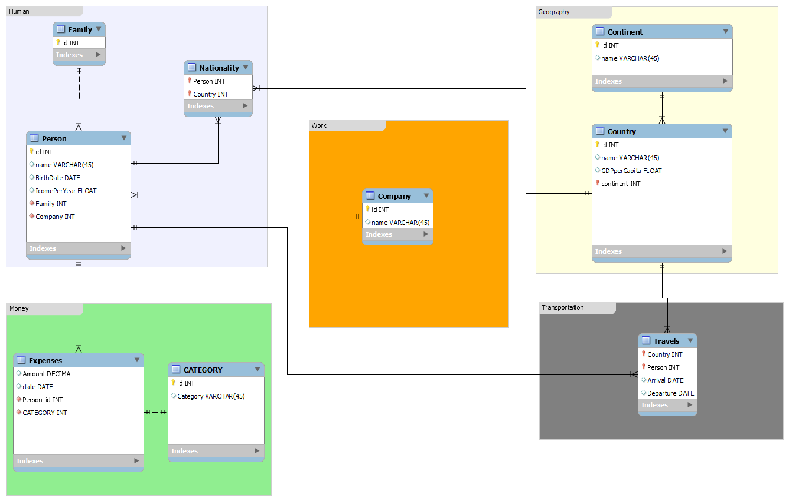

## MySQL_LIFE

## Table of Contents

- [Enhanced Entity-Relationship Diagram](#EER)
- [EER to Database](#ToDatabase)
- [Random Queries](#Random)
- [Target Queries](#Target)
- [How to Replicate](#Replicate)

## EER

## To Database

LIFE.sql file have the necessary commands to create a database as the EER and fill it with random infromation.

## Random

LIFE_Random_Queries.sql contains random queries that includes most of the basic command of SQL against MySQL.

## Target

LIFE_Target_Queries.sql contains more complex queries from the database.

## Replicate

This simple project is built using VS code (install MySQL extension on VS code) to write the sql queries and MySQL workbench to develop the EER.
